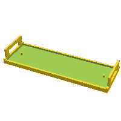
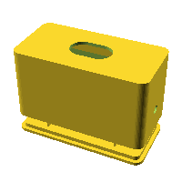

Shapes for 3D printing (OpenSCAD)
=================================

This repository contains parametric shapes modeled in OpenSCAD, intended to be exported as STL files and printed on a 3D printer.

## Models

| | Model | File |
| --- | --- | --- |
|  | **Gira Pushbutton Sensor Tile** Replacement cover tile for Gira Pushbutton Sensor 3 Komfort | [`gira-pushbutton-sensor-tile.scad`](gira-pushbutton-sensor-tile.scad) |
|  | **Shelly Switch Adapter** Adapter enclosure for fitting a Shelly Mini behind a wall switch | [`shelly-switch.scad`](shelly-switch.scad) |

## Usage

- Open any of the `.scad` files in OpenSCAD.
- Adjust parameters at the top of the file as needed.
- Press F6 (Render) to generate the final model.
- Export the model as an STL file and slice/print it with your preferred toolchain.
